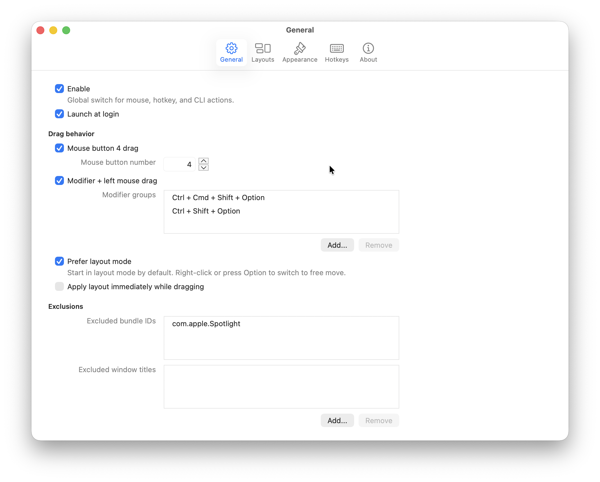
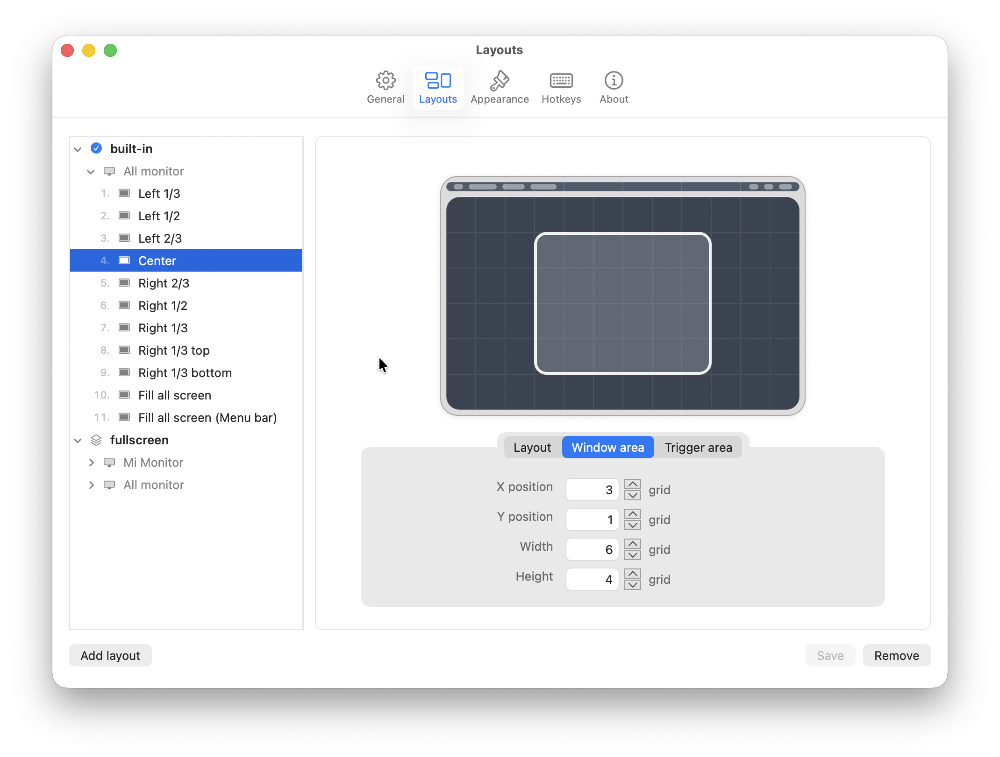

English | [中文](./README.zh-CN.md)

# GridMove for macOS

GridMove is a native macOS app for moving windows across monitors and snapping them into preset layouts.

Install with Homebrew:
```
brew install mirtlecn/tap/GridMove
```

Or download the latest release: [🔗](https://github.com/mirtlecn/GridMoveForMac/releases/latest/download/GridMove.arm64.dmg)

> [!IMPORTANT]
> The app is unsigned, you need to trust it in System Preferences > Privacy & Security **OR** run <br>
>
> ```
> xattr -dr com.apple.quarantine /Applications/GridMove.app
> ```

## Demo

Move windows by dragging from anywhere inside them.


Drag windows into preset spots to instantly resize and position them.


## Features

- Super fast and lightweight
- Trigger actions with mouse, keyboard, or CLI
- Move and resize windows across monitors
- Snap windows into any layout you want
- Use different layout sets for each monitor
- Switch layout group on the fly

## Quick Start

- Hold <kbd>Middle Mouse Button</kbd> briefly to apply a layout to the window under the cursor.
- Hold <kbd>Ctrl</kbd>+<kbd>Shift</kbd>+<kbd>Alt</kbd>, then left-click and hold to apply a layout to the window under the cursor.
- In layout mode, press <kbd>Option</kbd> or <kbd>Right Click</kbd> to enter free-move mode; click again to return to layout mode.
- In layout mode, press <kbd>Shift</kbd> or scroll the mouse wheel to cycle the active layout group.
- Use the menu bar or preset hotkeys to apply layouts to the currently focused window.
- Use the CLI to apply layouts to any window by ID.

## Screenshots

Settings



Custom layouts:




### CLI

GridMove relays CLI actions to a running app instance.

```bash
path/to/GridMove.app/Contents/MacOS/GridMove -next # move focus window
path/to/GridMove.app/Contents/MacOS/GridMove -pre
path/to/GridMove.app/Contents/MacOS/GridMove -layout 4
path/to/GridMove.app/Contents/MacOS/GridMove -layout "Center" 
path/to/GridMove.app/Contents/MacOS/GridMove -layout "Center" -window-id 12345 # move specific window in current monitor
```

## Development

```bash
# run tests
make test
# run locally
make dev
# build and package
make build
# build a release package
make release
```

## Additional Notes

- GridMove takes its name from a [Windows AHK app](https://github.com/mirtlecn/GridMove) I previously maintained. This project is essentially its macOS counterpart.
- The entire app—including the icon, documentation, and demo video—was built with OpenAI Codex. The user prompts are available [here](docs/prompts.txt). (Note: the file is 700 KB+.)
- [docs/APP-DESIGN.md](docs/APP-DESIGN.md) — runtime behavior, architecture, configuration details, and implementation notes
- [docs/CONFIG-REFERENCE.jsonc](docs/CONFIG-REFERENCE.jsonc) — Advanced JSON configuration reference
